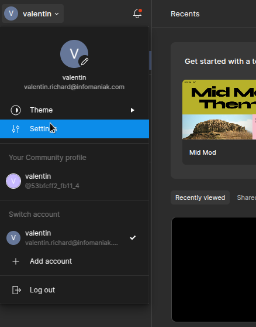
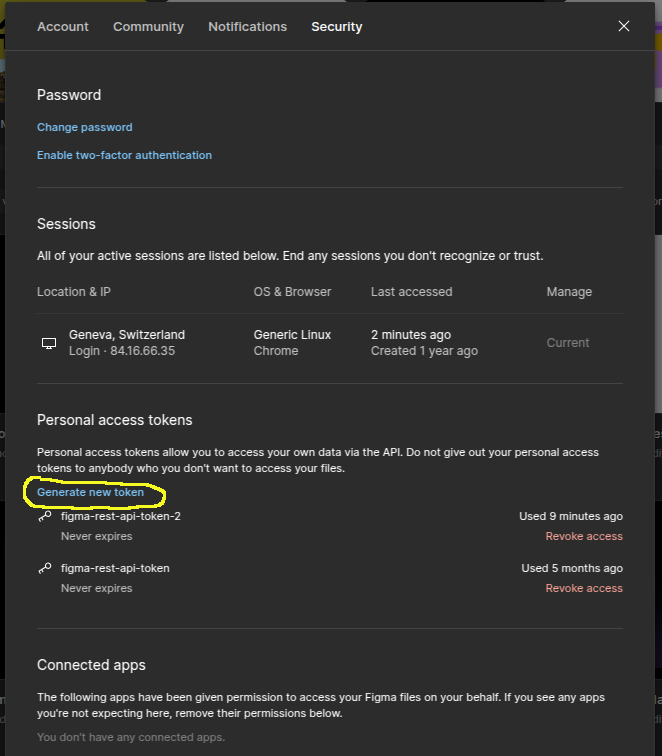
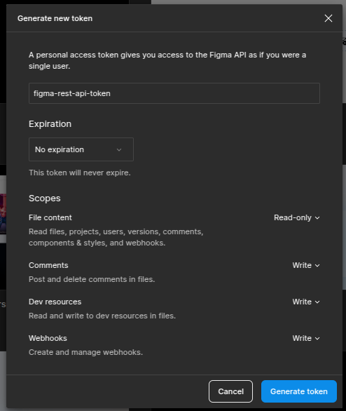
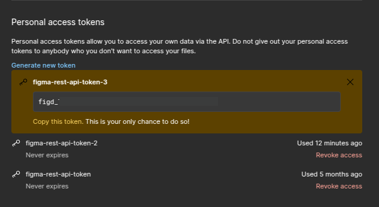

# Generate a `FIGMA_API_TOKEN`

Go to https://www.figma.com

On the top left corner, hover the menu, and click on `Settings`:



Then, click on the `Security` tab, and click on `Generate new token`:



This will open a modal to set-up your token. Fill the form and click `Generate token`:



Finally, **COPY THIS TOKEN**. This is the only time you'll be able to do so, so don't skip this step.



And put this token inside your `.env` file:

```dotenv
FIGMA_API_TOKEN="figd_xxxxxxxxxxxxxxxxxxxxxxxxxxxxxxxxxxxxxxxx"
```
