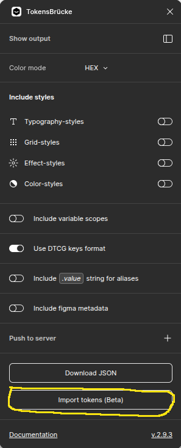
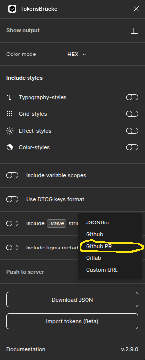
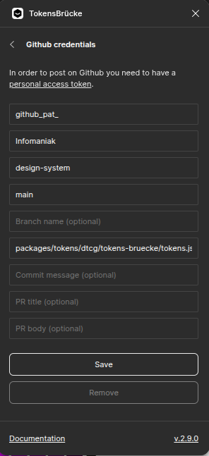
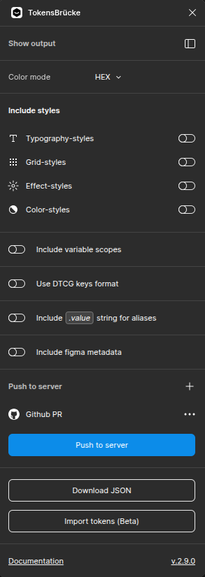

# Use Figma `TokensBrücke` plugin

- [github](https://github.com/tokens-bruecke/figma-plugin)
- [figma plugin page](https://www.figma.com/community/plugin/1254538877056388290/tokensbrucke)

## Install

Install the `TokensBrücke` plugin from the Figma Community.

## Import tokens

First remove all existing tokens from the `Variables` panel.

Then opens the `TokensBrücke` plugin, and click on the `Import tokens` button.

---

# LEGACY - DO NOT USE

## Configure

### Configure GitHub

On the `Push to server` section click on the "plus" icon, and select `GitHub PR`.

Then fill the form with:

- Personal access token: TODO doc link -> how to generate
- Owner: `Infomaniak`
- Repo name: `design-system`
- Base branch: `main`
- File name: `packages/tokens/dtcg/tokens-bruecke/tokens.json`

And click `Save`.

### Push to GitHub

Click on the `Push to server` button and await the PR to be created (success notification).

